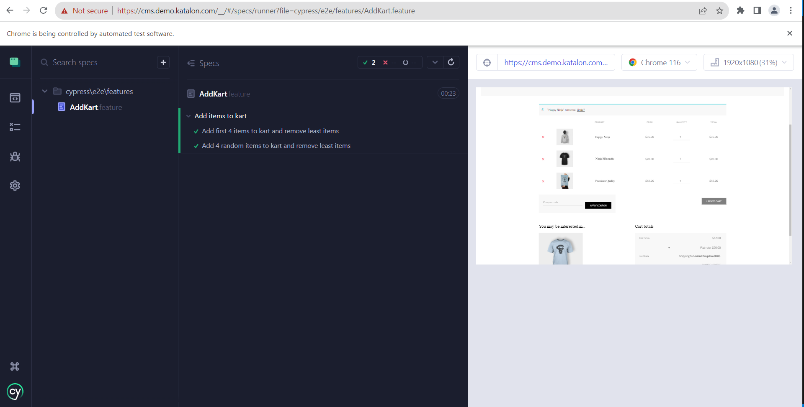
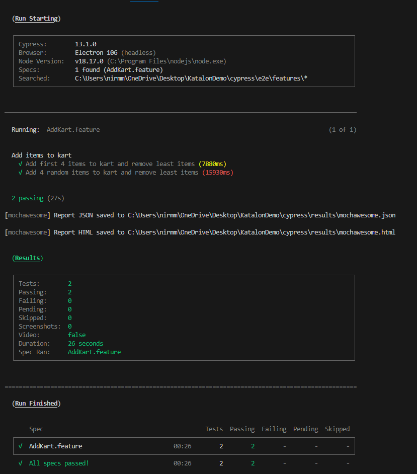
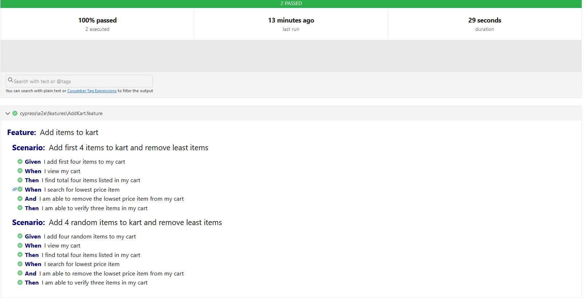
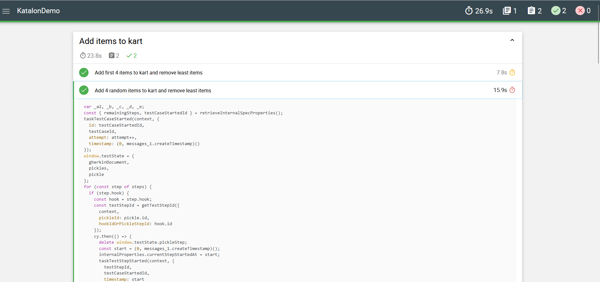

### Cypress - Cucumber Demo Project

This is a demo project which automates a sample scenario from Katalon demo website

### Getting started.

This project needs `node.js`, so install latest node js LTS version

Run `npm install` in the project root directory to download all dependencies to node_modules folder

#### Test features and programs

Cucumber feature files and step definitions are present in `cypress\e2e`
Page objects are present in `cypress\pages`

### Test execution

1. Through Cypress GUI - run command `npm run cy-open`
2. Through Cypress CLI - run command `npm run cy-run`

#### Sample execution in Cypress GUI

#### Sample execution in Cypress CLI

#### Sample cucumber html report

#### Sample Mochaawesome report

#### Sample test reports and video are present in `sample` folder